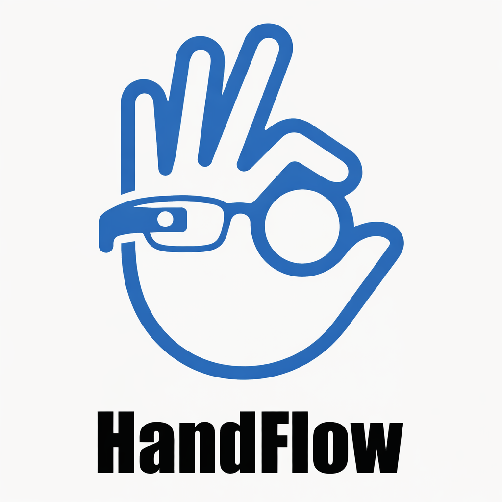
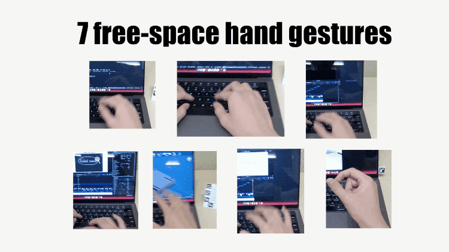
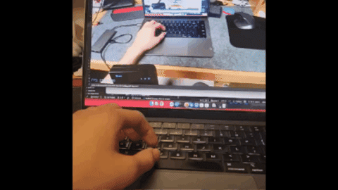
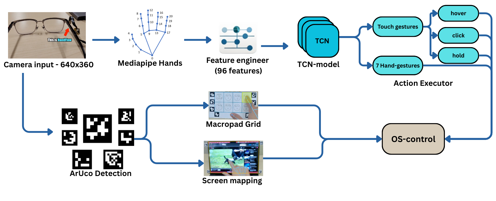

<p align="center">
  
  <h1 align="center">HandFlow</h1>
  <p align="center">
    Real-time hand gesture recognition for touchless human-computer interaction
    <br />
    <a href="#demo">View Demo</a> &middot; <a href="#getting-started">Get Started</a> &middot; <a href="#architecture">Architecture</a>
  </p>
</p>

<p align="center">
  
  
  
  
  
</p>

---

HandFlow is an end-to-end gesture recognition system that turns a standard webcam into a touchless input device. It combines a lightweight temporal convolutional network with computer vision to support **free-space gesture control**, **virtual touchscreens**, and **printable paper macro pads** — all running at **real-time speed on CPU**.

## Demo

<p align="center">
  <a href="https://youtu.be/vPmRHNnpoD4">
    
  </a>
</p>

<p align="center">
  <a href="https://youtu.be/pJZUeKDYaQk">
    
  </a>
</p>


<p align="center"><i>*This is a MacBook — not a touchscreen laptop. The paper macro pad is an A4 printed paper, not connected to the laptop in any way. All connection and computation are done via camera tracking.</i></p>

### V1 Key Features

<table>
  <tr>
    <td align="center">
      <b>Virtual Touchscreen</b><br/>
      <i>Transform any non-touch display into a touchscreen using ArUco marker calibration</i>
      
    </td>
    <td align="center">
      <b>Free-Space Hand Gestures</b><br/>
      <i>7 hand gestures for touchless computer control — swipe, click, scroll, zoom, and more</i></br>
      
    </td>
  </tr>
  <tr>
    <td align="center">
      <b>12-Button Touch Macro Pad</b><br/>
      <i>On-screen macro pad with 12 customizable buttons, activated by touch gestures</i></br>
      
    </td>
    <td align="center">
      <b>24-Button Paper Macro Pad</b><br/>
      <i>Print a foldable A4 sheet with ArUco markers — 3 sets of 8 buttons each</i>
      
    </td>
  </tr>
</table>

### V2 Key Features

<table>
  <tr>
    <td align="center">
      <b>Finger's knuckle button</b><br/>
      <i>Transform your finger's knuckles (inner palm, the finger regions separted by finger joints) into buttons.</i><br/>
      
    </td>
    <td align="center">
      <b>Live Capture + AI</b><br/>
      <i>Capture using the front glass's camera, paste the capture image to notes/save it or get response/ask Google Gemini</i>
      
    </td>
  </tr>
  <tr>
    <td align="center">
      <b>SkimTouch</b><br/>
      <i>Touch your thumb to index finger (don't need to lift your hand of the keyboard) to quickly skim through another desktop, then go back quickly by just releasing</i>
      
    </td>
    <td align="center">
      <b>MagSnap</b><br/>
      <i>Camera can be attached easily and better visual appearance with custom case design</i>
      
    </td>
  </tr>
</table>

### Old versions v0:


## Architecture

<p align="center">
  
</p>

### Pipeline

1. **MediaPipe Hands** extracts 21 3D hand landmarks per frame (63 raw coordinates) at up to 2 hands simultaneously, configured with detection confidence 0.5 and tracking confidence 0.3
2. **Feature Engineer** transforms the raw 84-dimensional keypoints (21 landmarks x 4 values: x, y, z, visibility) into a 96-dimensional feature vector per frame — including wrist-normalized positions (63), inter-finger distances (5), absolute positions for screen mapping (9), FPS-normalized velocities (9), PIP joint bending angles (5), pinch dynamics (3), and thumb posture (2)
3. **TCN Model** takes a sliding window of 12 consecutive feature frames (~600 ms at 20 FPS) and classifies into one of 17 gesture classes
4. **Action Executor** dispatches the predicted gesture to OS-level actions (keyboard shortcuts, mouse control, app launches) with per-hand and per-gesture configurable action chains (up to 10 actions per gesture)

### Model — Temporal Convolutional Network (TCN)

The primary architecture is a **TCN with residual dilated causal convolutions**, designed for low-latency temporal pattern recognition on CPU.

```
┌─────────────────────────────────────────────────┐
│                 Input (12, 96)                   │
│          12-frame window × 96 features          │
└────────────────────┬────────────────────────────┘
                     │
                     ▼
┌─────────────────────────────────────────────────┐
│            1×1 Conv Projection                  │
│              96 → 128 channels                  │
└────────────────────┬────────────────────────────┘
                     │
                     ▼
┌─────────────────────────────────────────────────┐
│         Residual Block (dilation=1)             │
│  ┌────────────────────────────────────────────┐ │
│  │ Conv1D(128, k=3, d=1) → BatchNorm → ReLU  │ │
│  │ Conv1D(128, k=1)      → BatchNorm → Drop  │ │
│  └──────────────────┬─────────────────────────┘ │
│           + residual connection → ReLU          │
└────────────────────┬────────────────────────────┘
                     │
                     ▼
┌─────────────────────────────────────────────────┐
│         Residual Block (dilation=2)             │
│         (same structure, RF = 5 frames)         │
│           + residual connection → ReLU          │
└────────────────────┬────────────────────────────┘
                     │
                     ▼
┌─────────────────────────────────────────────────┐
│         Residual Block (dilation=4)             │
│    (same structure, RF = 13 — full window)      │
│           + residual connection → ReLU          │
└─────────┬──────────────────────────┬────────────┘
          │                          │
          ▼                          ▼
┌──────────────────┐   ┌──────────────────────┐
│  Global AvgPool  │   │   Global MaxPool     │
└────────┬─────────┘   └──────────┬───────────┘
         │                        │
         └───────────┬────────────┘
                     ▼
┌─────────────────────────────────────────────────┐
│            Concatenate (256-dim)                 │
└────────────────────┬────────────────────────────┘
                     │
                     ▼
┌─────────────────────────────────────────────────┐
│       Dense(64, ReLU) → Dropout(0.1)            │
└────────────────────┬────────────────────────────┘
                     │
                     ▼
┌─────────────────────────────────────────────────┐
│          Dense(17, Softmax) → Output            │
│              17 gesture classes                 │
└─────────────────────────────────────────────────┘
```

| Spec | Details |
|------|---------|
| Input shape | `(12, 96)` — 12-frame window x 96 features |
| 1x1 projection | Projects 96 input features to 128 channels |
| Temporal blocks | 3 residual blocks with dilations `[1, 2, 4]` and kernel size 3 |
| Residual block | Dilated Conv1D &rarr; BatchNorm &rarr; ReLU &rarr; 1x1 Conv1D &rarr; BatchNorm &rarr; Dropout &rarr; residual add &rarr; ReLU |
| Receptive field | 13 frames (covers the entire 12-frame input window) |
| Pooling | Concatenated global average + global max pooling (256-dim) |
| Classifier head | Dense(64, ReLU) &rarr; Dropout(0.1) &rarr; Dense(17, softmax) |
| Model size | 2.7 MB (Keras) &rarr; 907 KB (TFLite, 66% reduction via quantization) |
| Inference | ~25–30 FPS end-to-end on CPU (including MediaPipe + feature extraction + ArUco), capped at 20 FPS for data feeding |

**Alternative architectures** (all swappable via config): LSTM (2-layer, 128/64 units), GRU (2-layer, 128/64 units), 1D-CNN (3-layer with BatchNorm + MaxPooling), Transformer (2 blocks, 4-head attention with learned positional encoding).

### Training

| Spec | Details |
|------|---------|
| Optimizer | Adam (lr=0.0001) |
| Loss | Categorical cross-entropy |
| Batch size | 4 |
| LR scheduler | ReduceLROnPlateau (factor=0.5, patience=8, min_lr=1e-7) |
| Early stopping | Patience=25 epochs |
| Validation split | 15% |
| Augmentation | 6 variants per sample (online geometric augmentation) |
| Experiment tracking | Weights & Biases + TensorBoard |

### Data Augmentation

Online geometric augmentation applied during training to improve generalization across hand sizes, camera angles, and depth variations:

| Augmentation | Probability | Details |
|--------------|-------------|---------|
| Gaussian noise | 40% | Motion-adaptive (reduced when hand is static), capped per-frame jitter |
| Uniform scaling | 20% | Scale range [0.9, 1.1] — simulates hand distance variation |
| 2D rotation | 15% | [-8, 8] degrees — simulates wrist rotation |
| Z-axis scaling | 30% | [0.85, 1.15] — simulates depth sensor variation |
| Z-axis shift | 30% | [-0.08, 0.08] — simulates camera depth offset |
| Z proportional | 25% | [0.85, 1.15] — scales fingertip-to-wrist depth |
| Z finger length | 25% | [0.9, 1.1] — simulates hand size variation per finger |
| Z noise | 40% | Depth-specific Gaussian noise (std=0.004) |
| Hand tilt | 20% | [-12, 12] degrees — rotates around Y-Z plane (wrist-relative) |
| Landmark dropout | 15% | Drops whole landmarks or fingertips to simulate occlusion |

### Feature Engineering (96 dimensions)

| Feature Group | Dims | Description |
|---------------|------|-------------|
| Relative positions | 63 | Wrist-normalized x, y, z for 21 landmarks (translation invariance) |
| Inter-finger distances | 5 | Thumb-to-each-fingertip + thumb-to-index-PIP Euclidean distances |
| Absolute positions | 9 | Raw x, y, z of thumb tip, index MCP, index tip (for screen mapping) |
| Velocities | 9 | Frame-to-frame motion vectors for index MCP, index tip, thumb tip |
| Finger angles | 5 | PIP joint bending angle per finger in radians (via 3-point arccos) |
| Pinch dynamics | 3 | Thumb-index aperture velocity, aperture acceleration, z-depth difference |
| Thumb posture | 2 | Thumb abduction angle (thumb vs palm vector) + thumb-to-wrist distance |

All velocities are FPS-normalized to a 20 FPS reference using `delta_time` scaling, ensuring consistent gesture recognition across different hardware frame rates.

## Supported Gestures

| Gesture | Description |
|---------|-------------|
| `none` | Idle / baseline |
| `horizontal_swipe` | Lateral hand movement |
| `swipeup` | Upward vertical motion |
| `thumb_index_swipe` | Thumb-index directional swipe |
| `thumb_middle_swipe` | Thumb-middle directional swipe |
| `5_fingers_close` | All fingers pinch together |
| `pointyclick` | Index finger point and click |
| `middleclick` | Middle finger click |
| `touch_hover` | Finger hovering (cursor movement) |
| `touch_hold` | Sustained contact (drag) |
| `touch` | Brief contact (click) |

Each gesture supports per-hand action mapping with up to 10 chained actions.

## Project Structure

```
HandFlow/
├── src/handflow/
│   ├── app/
│   │   ├── app.py                     # Main GUI window (tabbed interface)
│   │   ├── detection_window.py        # Real-time camera preview and detection loop
│   │   ├── gesture_feedback.py        # Floating gesture activation overlay
│   │   ├── screen_overlay_macropad.py # On-screen 12-button macro pad with ArUco markers
│   │   └── paper_macropad_feedback.py # Hover/click feedback overlay for paper macro pad
│   ├── detector/
│   │   ├── gesture_detector.py        # Gesture inference and action dispatch
│   │   ├── screen_detector.py         # ArUco-based screen boundary detection
│   │   ├── macropad_detector.py       # Paper macro pad marker detection
│   │   ├── macropad_manager.py        # Multi-set macro pad state management
│   │   └── handedness_tracker.py      # Left/right hand assignment
│   ├── features/
│   │   └── feature_engineer.py        # 96-feature extraction (positions, velocities, angles)
│   ├── models/
│   │   ├── architectures.py           # TCN, LSTM, GRU, CNN1D, Transformer builders
│   │   ├── trainer.py                 # Training loop with callbacks and tracking
│   │   └── calibration.py             # ArUco homography calibration
│   ├── actions/
│   │   ├── action_executor.py         # Gesture-to-OS-action dispatcher
│   │   ├── mouse_controller.py        # Cursor movement, clicks, and drag
│   │   └── scroller.py                # Scroll automation
│   ├── data/
│   │   ├── loader.py                  # Raw and processed data loading
│   │   ├── validator.py               # Sequence validation (NaN, outliers, length)
│   │   └── augmentation.py            # Online geometric augmentation
│   ├── evaluation/
│   │   ├── evaluator.py               # Accuracy, loss, and misclassification analysis
│   │   └── visualizer.py              # Confusion matrices, feature plots
│   ├── utils/
│   │   ├── config.py                  # YAML config loading with Pydantic validation
│   │   ├── setting.py                 # User preferences and gesture mappings
│   │   ├── logging.py                 # Structured logging setup
│   │   ├── smoothing.py               # OneEuro filter for cursor tracking
│   │   ├── experiment_tracker.py      # Weights & Biases + TensorBoard integration
│   │   └── macropad_pdf_generator.py  # Printable A4 macro pad PDF generation
│   └── cli.py                         # Command-line interface entry point
├── scripts/
│   ├── train.py                       # Model training (supports resume from checkpoints)
│   ├── export.py                      # Keras to TFLite conversion
│   ├── collect_data.py                # GUI-based gesture data collection
│   ├── dataset.py                     # Data preprocessing and validation
│   ├── process_video.py               # Offline video processing with visualization
│   ├── benchmark_inference.py         # Architecture speed comparison
│   └── benchmark_tflite.py            # End-to-end pipeline benchmarking
├── config/                            # YAML configs (model, training, user settings)
├── models/                            # Trained model artifacts (.keras, .tflite)
├── tests/                             # Unit and integration tests
└── main.py                            # Application entry point
```

## Engineering Highlights

### Macro Pad Prototyping — 15+ Design Iterations

The paper macro pad required extensive physical prototyping to find the optimal marker arrangement. Over 15 prototypes were designed, printed, and tested to balance competing constraints:

- **Marker placement vs. button density** — Maximizing the number of usable buttons while keeping enough ArUco markers visible for reliable detection at varying angles and distances.
- **Hand occlusion tolerance** — During normal use, the user's hand covers parts of the sheet. Marker positions were iterated to ensure that at least enough markers remain visible for accurate grid reconstruction, even when multiple buttons are pressed in sequence.
- **Origami-inspired foldable design** — The final A4 layout folds into a triangular prism with 3 faces of 8 buttons each (24 buttons total), inspired by origami folding techniques. The prism form factor keeps one active face angled toward the camera at all times, while allowing the user to rotate to a different set by simply flipping the prism.
- **Camera angle robustness** — Tested across different webcam heights, tilt angles, and lighting conditions to ensure consistent detection without requiring precise camera placement.

### Marker Occlusion Recovery Algorithm

A core engineering challenge was maintaining stable spatial mapping when markers are partially or fully occluded by the user's hand. The detection pipeline uses an 8-marker layout (4 corners + 4 edge midpoints, with fallback bottom-corner markers) and implements a multi-stage recovery strategy:

1. **Geometric estimation from visible markers** — When a marker is occluded, its position is estimated using the known spatial relationships between all markers. For example, a missing corner can be reconstructed from adjacent edge midpoints and the opposite corner via vector arithmetic.
2. **Cached position fallback** — If too few markers are visible for geometric estimation, the system falls back to cached positions from recent frames, maintaining continuity during brief occlusions.
3. **Perspective-aware grid subdivision** — The recovered 4-corner detection region is subdivided into the button grid using perspective-correct interpolation, ensuring buttons remain accurately mapped even under partial homography distortion.

This approach enables reliable button detection even when 3-4 out of 8 markers are simultaneously occluded — a common scenario during active use.

## Tech Stack

| Component | Technology |
|-----------|------------|
| ML Framework | TensorFlow 2.16 / Keras + TFLite |
| Hand Tracking | MediaPipe Hands (21-landmark model) |
| Computer Vision | OpenCV (ArUco marker detection) |
| GUI | CustomTkinter |
| Experiment Tracking | Weights & Biases + TensorBoard |
| Config | Pydantic + YAML |
| Testing | pytest |

## License

Copyright (c) 2025 Andy Huynh. All rights reserved.

This project is proprietary. No part of this codebase may be reproduced, distributed, or used without explicit written permission from the author.

## Acknowledgments

- [MediaPipe](https://mediapipe.dev/) — hand landmark detection
- [OpenCV](https://opencv.org/) — ArUco markers and image processing
- [Weights & Biases](https://wandb.ai/) — experiment tracking
